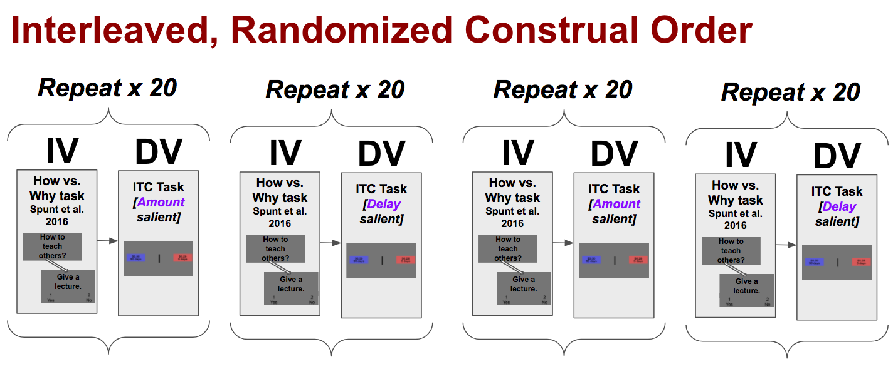
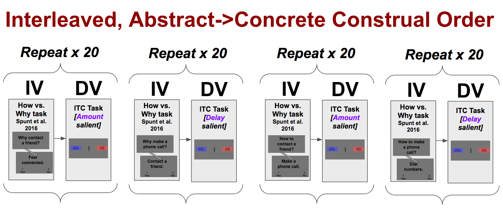
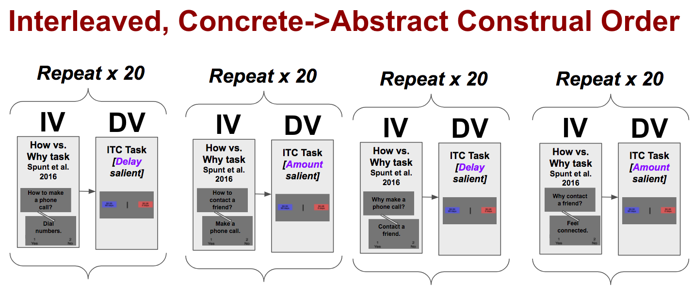
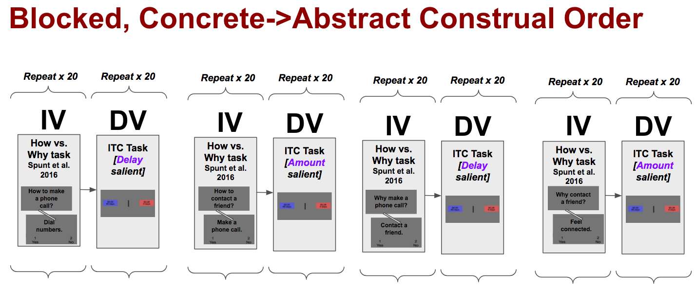

```{r setup, include=FALSE}
knitr::opts_chunk$set(echo = FALSE)
knitr::opts_chunk$set(cache = TRUE)
```

```{r setup2, include=FALSE}
library(ggplot2)
library(knitr)
library(tidyr)
library(lme4)
source("load_and_preprocess_compiled_data20180330.R")

#data.itc[is.na(EstimatedSubjKIndifferenceAllTrials)]

data.itc<-data.itc[EstimatedSubjKIndifferenceAllTrials!=Inf & !is.nan(EstimatedSubjKIndifferenceAllTrials) & !is.na(EstimatedSubjKIndifferenceAllTrials)]
which(is.na(data.itc$EstimatedSubjKIndifferenceAllTrials))
data.itc$LogKIndiff<-log(data.itc$EstimatedSubjKIndifferenceBySalienceCondition)
data.itc<-data.itc[(LogKIndiff> -10000) & (LogKIndiff< 10000)]
```


## Intro

This analysis closely follows the analysis that I prespecified before collecting data on https://osf.io/8te4b/ . At that location, it is embargoed, but it is also available at https://osf.io/uhgwn/ for our team internally.

***


##Deviation from pre-registration

The SmallerSooner amount in the FixedAmount condition changed from \$0.50 to \$0.40, after the first round, in which it seemed like subjects in that condition were too strongly biased toward SmallerSooner.

Due to a technical error, one group of subjects were incorrectly told rewards were real when they were actually hypothetical. These have been excluded from the current analysis.

We introduced an extra between-subjects variable, Hypothetical vs. Real, that was not described on the uploaded pre-registration (I'd intended to upload this, but uploaded the older version of the pre-registration by mistake). To maintain a 3x2x2 between-subjects design, SalienceCondition was moved to be a within-subjects, between-trials variable.

***

## Aims/hypotheses

### Construal level
For this study, we want to test this predictions relevant to construal level:

1. A Construal Level manipulation has an effect on temporal discounting, such that more abstract construal level manipulations predict lower rates of temporal discounting
  a. This relationship will be observable with random construal order
  b. This relationship will be observable with the abstract to concrete and the concrete to abstract construal order conditions, OR
  c. This relationship will only be observable in the direction observed by Yi et al. (2017), i.e., only among participants who view the concrete condition prior to the abstract prediction
  d. This relationship will be observable in the interleaved conditions
  e. This relationship will be observable in the blocked conditions


***

### Sugar manipulation

We also want to test these predictions relevant to sugar manipulation:

2. Across other manipulations, participants will exhibit steeper delay discounting in test blocks in which Amount is fixed compared to blocks in which Delay is fixed (“block type”).
3. There will be an interaction between block type and fatigue/appetite, such that high appetite/fatigue scores will be associated with the larger block type differential in discounting

***

### Supplementary predictions:
1. (as above)
  f. This relationship will be observable when displaying hypothetical rewards
  g. This relationship will be observable when displaying real rewards

***


## Measures

### Intertemporal Choice
I pre-registered two ways of measuring intertemporal choices:

1. the absolute choice of LargerLater vs. SmallerSooner
2. the deviation of each choice from the expected present value, estimated the expected present value using the estimate for the subject’s k value obtained at the end of each run of the task.

### Construal Level Choices

4 levels of abstraction:

1. Most concrete how questions, e.g., "How to make a phone call? Dial numbers."
2. Somewhat concrete how questions, e.g., "How to contact a friend? Make a phone call."
3. Somewhat abstract why questions, e.g., "Why make a phone call? Contact a friend."
4. Most abstract why questions, e.g., "Why contact a friend? Feel connected."

### Conditions:

Across subjects:

1. Reward Type (Real vs. Hypothetical)
3. Construal order (Randomized, Abstract to Concrete, or Concrete to Abstract)
4. Task Order (Interlaved or Blocked)

Within subjects:

1. Salience (Amount vs. Delay)

***

```{r, out.width = "900px"}

```

***

```{r, out.width = "900px"}

```

***

```{r, out.width = "900px"}

```

***

```{r, out.width = "900px"}

```

***

## Results

### Descriptive

```{r setup3, include=FALSE}
#we were going to throw out subjects with lots of L or R, subjects with very low k-values, subjects with low response rates, or where they choose less than 16.7% of LEFT or RIGHT or 1 or 2 responses.


exclusion_stats<-data.itc[,.(
  LeftProp=sum(ChoiceKey==1,na.rm = TRUE)/sum(!is.na(ChoiceKey)),
  RightProp=sum(ChoiceKey==2,na.rm = TRUE)/sum(!is.na(ChoiceKey)),
  LeftRightChoices=sum(ChoiceKey==1 | ChoiceKey==2,na.rm=TRUE),
  ConstrualChoice1Prop=sum(ChoiceConstrual==1,na.rm = TRUE)/sum(!is.na(Answer)),
  ConstrualChoice2Prop=sum(ChoiceConstrual==2,na.rm = TRUE)/sum(!is.na(Answer)),
  #LogK=EstimatedSubjKIndifference,
  finalK=endingK[.N]),by=.(SubjectUniqueID,ConditionCode)]

kvalStats<-data.itc[,.(LogKValBySalienceCondition=log(EstimatedSubjKIndifferenceBySalienceCondition[1]),finalK=log(endingK[.N])),by=.(SubjectUniqueID,ConditionCode,salienceCondition)]
cor.test(kvalStats[salienceCondition=="DelaySalient"]$finalK,kvalStats[salienceCondition=="DelaySalient"]$LogKValBySalienceCondition)
cor.test(kvalStats[salienceCondition=="AmountSalient"]$finalK,kvalStats[salienceCondition=="AmountSalient"]$LogKValBySalienceCondition)
too_selective_subjs<- exclusion_stats%>% 
  .[LeftProp<.167 | LeftProp>(1-.167) | finalK<=0.0001,SubjectUniqueID]
data.itc<-data.itc[!(SubjectUniqueID %in% too_selective_subjs)]

data.itc[,.(NAChoices=sum(is.na(ChoiceKey))),by=.(SubjectUniqueID)] %>% .[order(NAChoices)]
#table(data.itc[SubjectUniqueID=="M730ARVGMonApr092018184028GMT0200CEST37168831",.(Choice,ChoiceKey,SSonLorR)])


```


There were `r length(too_selective_subjs)` subjects who were excluded for not meeting the pre-specified exclusion criteria. In hindsight, I could think of better criteria, but these criteria were OK.

Threw out:

- where they choose less than 16.7% of LEFT or RIGHT or 1 or 2 responses, for ITC (`r sum(exclusion_stats$LeftProp<.167 | exclusion_stats$RightProp<.167,na.rm = TRUE)` subjects) 
- ...or for construal (an error prevented me from collecting construal responses from a few subjects so I did not apply this criteria)
- final k-values below 0.0001 (`r sum(exclusion_stats$finalK<=0.0001,na.rm=TRUE) ` subjects)
- low response rates ( `r sum(exclusion_stats$LeftRightChoices<20 & exclusion_stats$LeftRightChoices>0)` subjects)

And I had to add one more criterion to get the code to run:

- estimated k indifference point between $ln(-1000)$ and $ln(1000)$

***

#### Descriptive 

We were left with:


```{r, echo=FALSE}
kable(data.itc[,.N, .(SubjectUniqueID,Group,TaskArrangement,RewardReality)] %>% .[,.N,.(RewardReality,Group,TaskArrangement)])
```

***

### Testing

To test each hypothesis, I:

- created a base hierarchical model to predict AbstractionLevel from Choice using random effects only
- created a test hierarchical model with the variable of interest
- used anova to test for a significant improvement in model fit using the model fit.

Base model is, for the $i$th trial and $j$th subject
<!-- http://www.tqmp.org/RegularArticles/vol08-1/p052/p052.pdf-->


$$\begin{aligned}
AbstractionLevel_{i,j}  = & \gamma_{00}+ \gamma_{10}estimatedK_{i,j} + \\
  & \gamma_{01}Subject_j+\gamma_{11}Subject_j Choice_{i,j}+U_{1j}Choice_{i,j}+U_{0j} +r_{i,j}
\end{aligned}$$

And the test model just adds one term:

$$\begin{aligned}
AbstractionLevel_{i,j}  = & \gamma_{00}+\gamma_{10}Choice_{i,j} + \gamma_{10}estimatedK_{i,j} + \\
  & \gamma_{01}Subject_j+\gamma_{11}Subject_j Choice_{i,j}+U_{1j}Choice_{i,j}+U_{0j} +r_{i,j}
\end{aligned}$$

***

### H1 Construal level


1. A Construal Level manipulation has an effect on temporal discounting, such that more abstract construal level manipulations predict lower rates of temporal discounting

```{r, echo=FALSE}
#absolute choice of largerlater vs. smallersooner
#needs to be further pre-processed so every row reflects a trial with a construal level and a choice
# table(data.to.analyze$ConstrualConditionAllocated,data.to.analyze$Choice)
# table(data.to.analyze$Choice,data.to.analyze$Choice01)
# table(is.na(data.to.analyze$ConstrualConditionAllocated))
# table(is.na(data.to.analyze$Choice))
# table(is.na(data.to.analyze$Choice))
# table(is.na(data.itc$EstimatedSubjKIndifferenceAllTrials))
# table(is.na(data.itc$EstimatedSubjKIndifferenceBySalienceCondition))


choicemodel.base.VarySubSlope<-lmer(AbstractionLevel~ LogKIndiff+(1+ChoiceIsLL|SubjectUniqueID)+ LogKIndiff+(1|salienceCondition),
                                    data.itc, control = lmerControl(optimizer = "Nelder_Mead"))
choicemodel.choice.VarySubSlope<-lmer(AbstractionLevel~LogKIndiff+ChoiceIsLL+(1+ChoiceIsLL|SubjectUniqueID)+(1|salienceCondition),
                                      data.itc, control = lmerControl(optimizer = "Nelder_Mead"))
#summary(choicemodel.base.VarySubSlope)
summary(choicemodel.choice.VarySubSlope)
anova(choicemodel.base.VarySubSlope,choicemodel.choice.VarySubSlope)

```

***

### Sub-hypotheses

This relationship will be observable:


```{r, include=FALSE}

choicemodel.base.VarySubSlope.rand<-lmer(AbstractionLevel~ LogKIndiff+(1|salienceCondition)+(1+ChoiceIsLL|SubjectUniqueID),data.itc[BlockDesignRandomized==TRUE], control = lmerControl(optimizer = "bobyqa"))
choicemodel.choice.VarySubSlope.rand<-lmer(AbstractionLevel~ChoiceIsLL+ LogKIndiff+(1|salienceCondition)+(1+ChoiceIsLL|SubjectUniqueID),data.itc[BlockDesignRandomized==TRUE], control = lmerControl(optimizer = "bobyqa"))
summary(choicemodel.base.VarySubSlope.rand)
summary(choicemodel.choice.VarySubSlope.rand)
h1a.anova<-anova(choicemodel.base.VarySubSlope.rand,choicemodel.choice.VarySubSlope.rand)

h1a.anova.pal<-h1a.anova$`Pr(>Chisq)`[2]

```

a)  with random construal order
   - No, $p=$ `r format.pval(h1a.anova.pal)`
   
b)  with the abstract to concrete and the concrete to abstract construal order conditions. The latter may be predicted by Yi et al. (2017).

```{r, include=FALSE}

getanovapval<-function(anovaobj){return(format.pval(anovaobj$`Pr(>Chisq)`[2],digits = 2))}
  
choicemodel.base.VarySubSlope.AF<-lmer(AbstractionLevel~LogKIndiff+salienceCondition+ (1+ChoiceIsLL|SubjectUniqueID),data.itc[BlockDesignAbstractFirst==TRUE])


choicemodel.base.VarySubSlope.CF<-lmer(AbstractionLevel~LogKIndiff+salienceCondition+ (1+ChoiceIsLL|SubjectUniqueID),data.itc[BlockDesignConcreteFirst==TRUE], 
                                       control = lmerControl(optimizer="Nelder_Mead"))
choicemodel.choice.VarySubSlope.AF<-lmer(AbstractionLevel~LogKIndiff + ChoiceIsLL+salienceCondition+
                                           (1+ChoiceIsLL|SubjectUniqueID),data.itc[BlockDesignAbstractFirst==TRUE], control = lmerControl(optimizer = "bobyqa"))

choicemodel.choice.VarySubSlope.CF<-lmer(AbstractionLevel~ChoiceIsLL+LogKIndiff+salienceCondition+
                                           (1+ChoiceIsLL|SubjectUniqueID),data.itc[BlockDesignConcreteFirst==TRUE],
                                         control=lmerControl(
                           optimizer ='optimx', optCtrl=list(method='nlminb')))

summary(choicemodel.choice.VarySubSlope.AF)
h1b1.anova<-anova(choicemodel.base.VarySubSlope.AF,choicemodel.choice.VarySubSlope.AF)


summary(choicemodel.choice.VarySubSlope.CF)
h1b2.anova<-anova(choicemodel.base.VarySubSlope.CF,choicemodel.choice.VarySubSlope.CF)

```
  
  - No, $p=$ `r getanovapval(h1b1.anova)`, $p=$ `r getanovapval(h1b2.anova)`


```{r, include=FALSE}
choicemodel.base.VarySubSlope.inter<-lmer(AbstractionLevel~LogKIndiff+salienceCondition+(1+ChoiceIsLL|SubjectUniqueID),data.itc[TaskArrangementBlocked==FALSE], control = lmerControl(optimizer = "Nelder_Mead"))
choicemodel.choice.VarySubSlope.inter<-lmer(AbstractionLevel~ChoiceIsLL+LogKIndiff+salienceCondition+(1+ChoiceIsLL|SubjectUniqueID),data.itc[TaskArrangementBlocked==FALSE], control = lmerControl(optimizer = "Nelder_Mead"))
summary(choicemodel.base.VarySubSlope.inter)
summary(choicemodel.choice.VarySubSlope.inter)
h1d.anova<-anova(choicemodel.base.VarySubSlope.inter,choicemodel.choice.VarySubSlope.inter)

```

d) This relationship will be observable in the interleaved conditions
  - We might expect this because the interleaved design will have a more immediate impact on the construal condition.
  - No,  $p=$ `r getanovapval(h1d.anova)`
  
```{r, include=FALSE}

choicemodel.base.VarySubSlope.inter<-lmer(AbstractionLevel~LogKIndiff+salienceCondition+(1+ChoiceIsLL|SubjectUniqueID),data.itc[TaskArrangementBlocked==TRUE], control = lmerControl(optimizer = "Nelder_Mead"))
choicemodel.choice.VarySubSlope.inter<-lmer(AbstractionLevel~ChoiceIsLL+LogKIndiff+salienceCondition+(1+ChoiceIsLL|SubjectUniqueID),data.itc[TaskArrangementBlocked==TRUE], control = lmerControl(optimizer = "Nelder_Mead"))
summary(choicemodel.base.VarySubSlope.inter)
summary(choicemodel.choice.VarySubSlope.inter)
h1e.anova<-anova(choicemodel.base.VarySubSlope.inter,choicemodel.choice.VarySubSlope.inter)

```

e) This relationship will be observable in the blocked conditions
  - we might expect this because subjects are continuously exposed to a particular abstraction level
  - No, $p=$ `r getanovapval(h1e.anova)`
  

```{r, include=FALSE}

choicemodel.base.VarySubSlope.hypo<-lmer(AbstractionLevel~LogKIndiff+salienceCondition+(1+ChoiceIsLL|SubjectUniqueID),data.itc[RewardReality=="Hypothetical"], control = lmerControl(optimizer = "Nelder_Mead"))
choicemodel.choice.VarySubSlope.hypo<-lmer(AbstractionLevel~ChoiceIsLL+LogKIndiff+salienceCondition+(1+ChoiceIsLL|SubjectUniqueID),data.itc[RewardReality=="Hypothetical"], control = lmerControl(optimizer = "Nelder_Mead"))
summary(choicemodel.base.VarySubSlope.hypo)
summary(choicemodel.choice.VarySubSlope.hypo)
h1f.anova<-anova(choicemodel.base.VarySubSlope.hypo,choicemodel.choice.VarySubSlope.hypo)

```

f) This relationship will be observable when displaying hypothetical rewards
- No, $p=$ `r getanovapval(h1f.anova)`

```{r, include=FALSE}

choicemodel.base.VarySubSlope.real<-lmer(AbstractionLevel~LogKIndiff+salienceCondition+(1+ChoiceIsLL|SubjectUniqueID),data.itc[RewardReality=="Real"], control = lmerControl(optimizer = "Nelder_Mead"))
choicemodel.choice.VarySubSlope.real<-lmer(AbstractionLevel~ChoiceIsLL+LogKIndiff+salienceCondition+(1+ChoiceIsLL|SubjectUniqueID),data.itc[RewardReality=="Real"], control = lmerControl(optimizer = "Nelder_Mead"))
summary(choicemodel.base.VarySubSlope.real)
summary(choicemodel.choice.VarySubSlope.real)
h1g.anova<-anova(choicemodel.base.VarySubSlope.real,choicemodel.choice.VarySubSlope.real)

```
g) This relationship will be observable when displaying real rewards
- No, $p=$ `r getanovapval(h1g.anova)`

# Exploratory

I subsequently tried examining a smaller subset: *only* subjects who were in the Concrete First condition (as in Yi et al., 2017), *and* whose construal and ITC trials were blocked, rather than interleaved.


```{r, echo=FALSE}

choicemodel.base.VarySubSlope.blockedconcrete<-lmer(AbstractionLevel~LogKIndiff+salienceCondition+(1+ChoiceIsLL|SubjectUniqueID),data.itc[TaskArrangementBlocked==TRUE & BlockDesignConcreteFirst==TRUE], control = lmerControl(optimizer = "Nelder_Mead"))
choicemodel.choice.VarySubSlope.blockedconcrete<-lmer(AbstractionLevel~ChoiceIsLL+LogKIndiff+salienceCondition+(1+ChoiceIsLL|SubjectUniqueID),data.itc[TaskArrangementBlocked==TRUE & BlockDesignConcreteFirst==TRUE], control = lmerControl(optimizer = "Nelder_Mead"))
summary(choicemodel.base.VarySubSlope.blockedconcrete)
summary(choicemodel.choice.VarySubSlope.blockedconcrete)
blockedconcrete.anova<-anova(choicemodel.base.VarySubSlope.blockedconcrete,choicemodel.choice.VarySubSlope.blockedconcrete)

# choicemodel.base.VarySubSlope.blockedabstract<-lmer(AbstractionLevel~LogKIndiff+salienceCondition+(1+ChoiceIsLL|SubjectUniqueID),data.itc[TaskArrangementBlocked==TRUE & BlockDesignAbstractFirst==TRUE], control = lmerControl(optimizer = "Nelder_Mead"))
# choicemodel.choice.VarySubSlope.blockedabstract<-lmer(AbstractionLevel~ChoiceIsLL+LogKIndiff+salienceCondition+(1+ChoiceIsLL|SubjectUniqueID),data.itc[TaskArrangementBlocked==TRUE & BlockDesignAbstractFirst==TRUE], control = lmerControl(optimizer = "Nelder_Mead"))
# summary(choicemodel.base.VarySubSlope.blockedabstract)
# summary(choicemodel.choice.VarySubSlope.blockedabstract)

ggplot(data.itc[TaskArrangementBlocked==TRUE & BlockDesignConcreteFirst==TRUE] %>% .[,.(PropLLChoices=sum(ChoiceIsLL,na.rm = TRUE)/.N),by=.(SubjectUniqueID,AbstractionLevel)],aes(x=AbstractionLevel,y=PropLLChoices,group=AbstractionLevel,color=AbstractionLevel)
       )+geom_boxplot()+geom_jitter(width=0.3,height=0,alpha=0.5)+labs(title="Proportion of LL Choices by Abstraction Level",y="Proportion of Larger Later choices")


```

#Sugar manipulation

##H2
H2: Across other manipulations, participants will exhibit steeper delay discounting in test blocks in which Amount is fixed compared to blocks in which Delay is fixed (“block type”).

To answer this I simply get a difference score of the indifference K discount factor for Amount compared to Delay
```{r, echo=FALSE}
kvalsBySalience<-spread(kvalStats[,.(SubjectUniqueID,salienceCondition,LogKValBySalienceCondition)],salienceCondition,LogKValBySalienceCondition)
kvalsBySalience$AmountMinusDelayK<-kvalsBySalience$AmountSalient-kvalsBySalience$DelaySalient
t.test(kvalsBySalience$AmountMinusDelayK)

```

*** 

##H3
H3: There will be an interaction between block type and fatigue/appetite, such that high appetite/fatigue scores will be associated with the larger block type differential in discounting.

We addressed appetite and fatigue by the following questions:

Eating:

- How many hours ago did you last eat food, whether it was a small snack or something bigger?
- How many hours ago did you last eat a full meal?

Fatigue:

- How tired do you feel right now? - 1
- How stressed do you feel right now? - 1

Hunger A:

- How hungry do you feel right now? - 1
- How satisfied do you feel right now? - 1
- How full do you feel right now? - 1

Hunger B: 

- How much do you: - think you can eat?
- How much do you: - want to eat something sweet?
- How much do you: - want to eat something savory?

***

H3 Results:

```{r, echo=FALSE}
kvalsBySalience<-spread(kvalStats[,.(SubjectUniqueID,salienceCondition,LogKValBySalienceCondition)],salienceCondition,LogKValBySalienceCondition)
kvalsBySalience$AmountMinusDelayK<-kvalsBySalience$AmountSalient-kvalsBySalience$DelaySalient
SubjDataSummary<-merge(data.itc[,.SD[.N],by=SubjectUniqueID],kvalsBySalience)
SubjDataSummary[,fatigue_mean:=(fatigue1_1+fatigue2_1)/2]
SubjDataSummary[,appetite_score:=(appetite1_1+(100-appetite2_1)+(100-appetite3_1))/3]
SubjDataSummary[,appetiteb_score:=(appetiteB_1+appetiteB_2+appetiteB_3)/3]
SubjDataSummary[,fatigueappetite:=(fatigue_mean+appetite_score+appetiteb_score)/3]
  
summary(lm(AmountMinusDelayK~fatigue_mean*appetite_score,SubjDataSummary))
summary(lm(AmountMinusDelayK~fatigue_mean,SubjDataSummary))
summary(lm(AmountMinusDelayK~appetite_score,SubjDataSummary))
summary(lm(AmountMinusDelayK~eat1,SubjDataSummary))
summary(lm(AmountMinusDelayK~eat2,SubjDataSummary))

summary(lm(AmountSalient~fatigue_mean+appetite_score+appetiteb_score,SubjDataSummary))
summary(lm(DelaySalient~fatigue_mean+appetite_score+appetiteb_score,SubjDataSummary))
summary(lm(DelaySalient~fatigueappetite,SubjDataSummary))
summary(lm(AmountSalient~fatigueappetite,SubjDataSummary))
summary(lm(AmountMinusDelayK~fatigueappetite,SubjDataSummary))


```

# Conclusion

 - There's some suggestion that AbstractionLevel relates to LargerLater choices. ( $p=$ `r getanovapval(blockedconcrete.anova)`) 
 - In favor of believing this: It makes a lot of theoretical sense, considering Yi et al. (2017)
 - We found this in a relatively small sample of 40 subjects.
 - Against it: I hadn't pre-specified that we'd find this.
 
